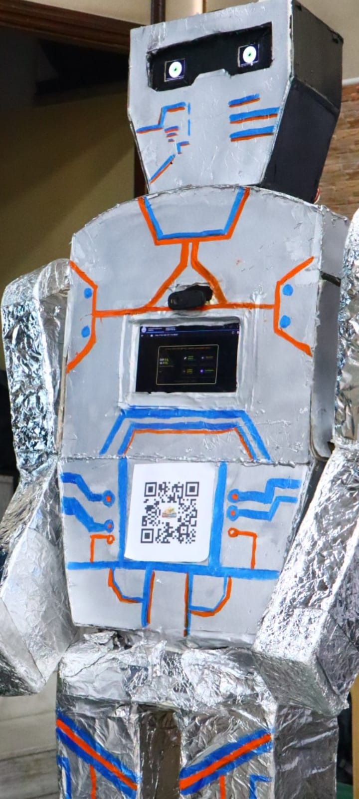
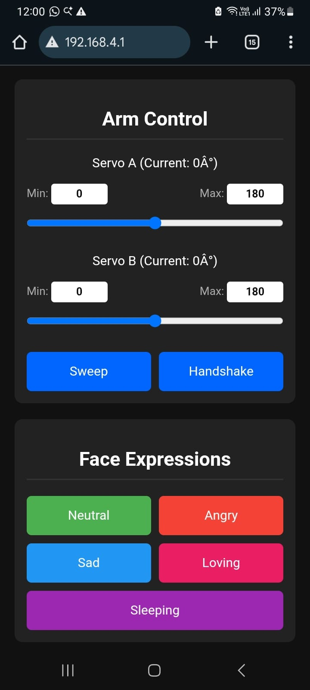
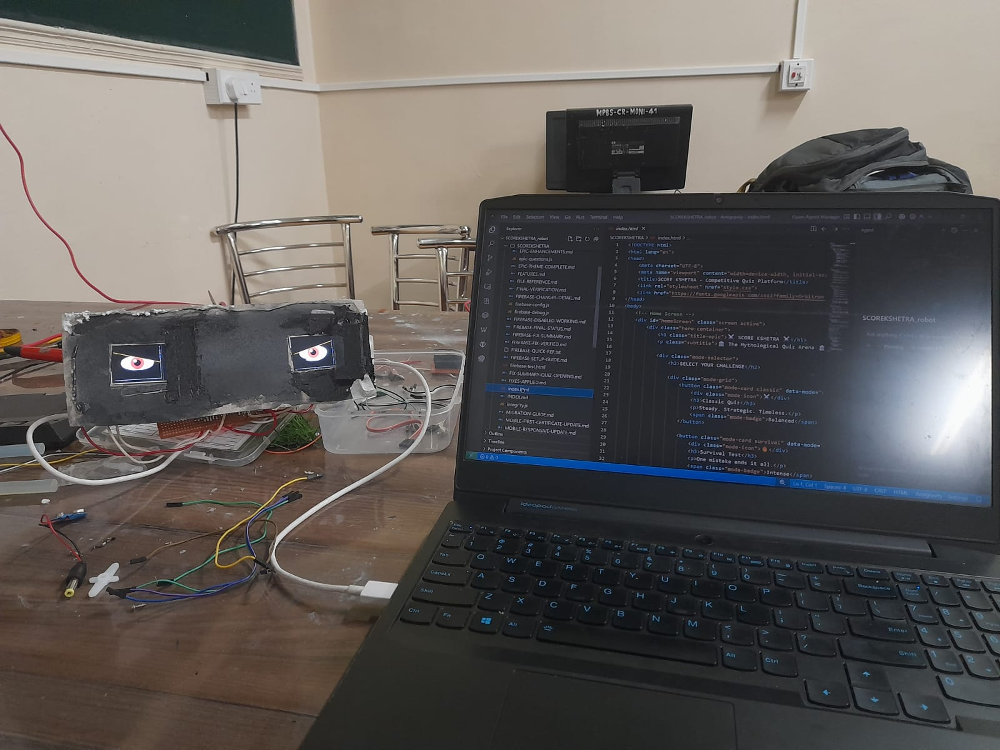
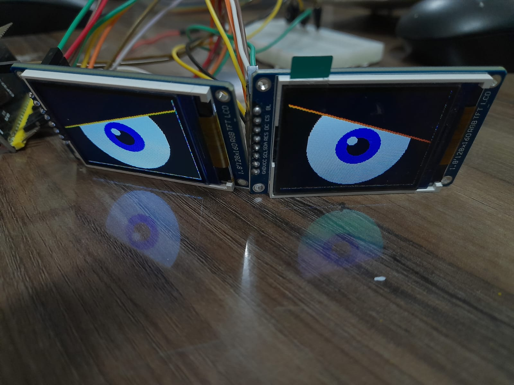
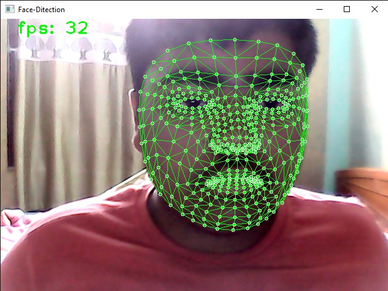
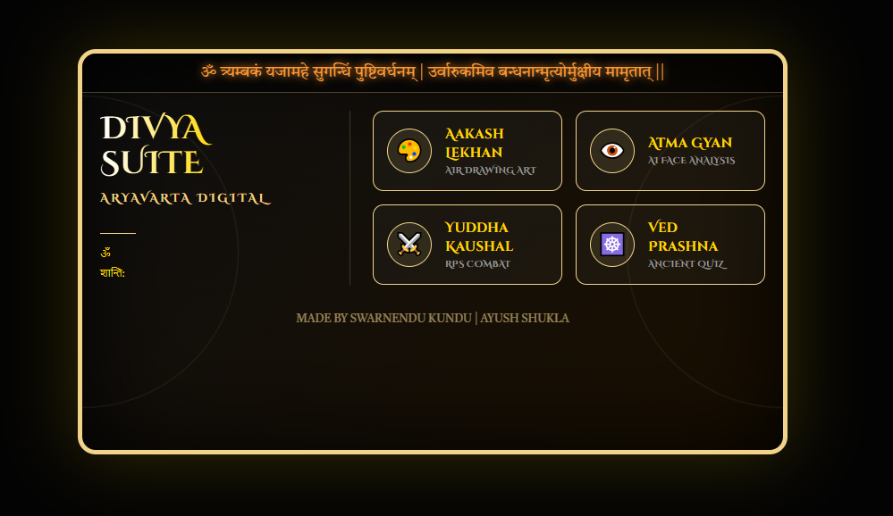

# 🤖 Aryabhata - Next-Gen Humanoid with AI Vision & Servo Control

<p align="center">
  <strong>An interactive humanoid robot controlled by ESP32-S3 with dual TFT displays, movable hands and real-time web interaction.</strong>
</p>

---

<p align="center">
  
  
  
  
  
  
</p>

---

<div align="center">
  <h3 style="font-family: 'Segoe UI', Tahoma, Geneva, Verdana, sans-serif; color: #2c3e50; margin-bottom: 20px;">
    🎯 Meet Aryabhata
  </h3>
  
  
  
  <p style="font-size: 16px; color: #34495e; font-weight: 500; margin: 10px 0;">
    <strong>A Complete Humanoid Robot</strong><br>
    <em style="color: #7f8c8d;">Named after the legendary mathematician, combining ancient wisdom with modern AI</em>
  </p>
</div>

---

<div style="background: linear-gradient(135deg, #f8f9fa 0%, #e9ecef 100%); padding: 40px 30px; border-radius: 12px; margin: 30px 0;">

## ⚡ Key Features & Capabilities

<div style="display: grid; gap: 30px;">

### 🎭 **Expressive Eye System**
- **Dual 160×128 TFT LCD Displays** with real-time animations
- **8 Emotion States**: Neutral, Angry, Sad, Loving, Sleeping, Wrong, Correct
- **Advanced Effects**: Blinking • Tears • Pupil tracking • Pulsing animations

### 🦾 **Precision Servo Control**
- **2× 20kg DS3218 Digital Servos** — High torque, smooth movements
- **PCA9685 PWM Driver** — 16-channel precision control
- **Custom Routines**: Handshake • Wave • Dance sequences

### 🎮 **Interactive Game Suite**
1. **Air Gesture Recognition** — Draw shapes in the air (Line, Arc, Circle, Zigzag)
2. **Face Matching Challenge** — Recognize mythological characters
3. **Rock-Paper-Scissors AI** — Compete with intelligent opponent

### 🌐 **Web & Connectivity**
- **WiFi AP Mode** — Self-hosted robot hotspot
- **Real-time WebSocket Communication** between PC and robot
- **Flask Web Dashboard** — Beautiful, intuitive control interface
- **Live Video Feed** — Camera stream with gesture overlay

### 🧠 **AI & Computer Vision**
- **MediaPipe Hand Tracking** — 21-point hand landmark detection
- **Face Detection & Analysis** — Real-time facial feature recognition
- **Gesture Interpretation** — Convert hand movements into commands

</div>

</div>

---

<h2 style="text-align: center; font-family: 'Segoe UI', Tahoma, sans-serif; color: #2c3e50; margin: 40px 0 30px 0;">📸 Gallery & Component Showcase</h2>

<div style="background: linear-gradient(135deg, #1e1e2e 0%, #2a2a3e 100%); padding: 40px 30px; border-radius: 15px; margin: 20px 0; border-left: 5px solid #60a5fa;">

### 🎯 Core Hardware System

<table style="margin: 20px 0; border-collapse: collapse; width: 100%;">
  <tr>
    <td align="center" width="25%" style="padding: 20px;">
      <div style="background: rgba(255,255,255,0.05); padding: 15px; border-radius: 10px;">
        
        <h4 style="margin: 15px 0 5px 0; color: #60a5fa; font-weight: 600;">🤖 Full Robot Model</h4>
        <p style="margin: 0; font-size: 13px; color: #cbd5e1;">Complete humanoid with expressive TFT displays</p>
      </div>
    </td>
    <td align="center" width="25%" style="padding: 20px;">
      <div style="background: rgba(255,255,255,0.05); padding: 15px; border-radius: 10px;">
        
        <h4 style="margin: 15px 0 5px 0; color: #60a5fa; font-weight: 600;">⚙️ Servo Control System</h4>
        <p style="margin: 0; font-size: 13px; color: #cbd5e1;">20kg DS3218 servo mechanics & hardware</p>
      </div>
    </td>
    <td align="center" width="25%" style="padding: 20px;">
      <div style="background: rgba(255,255,255,0.05); padding: 15px; border-radius: 10px;">
        
        <h4 style="margin: 15px 0 5px 0; color: #34d399; font-weight: 600;">😊 Happy Expression</h4>
        <p style="margin: 0; font-size: 13px; color: #cbd5e1;">TFT display - Neutral/Happy emotion state</p>
      </div>
    </td>
    <td align="center" width="25%" style="padding: 20px;">
      <div style="background: rgba(255,255,255,0.05); padding: 15px; border-radius: 10px;">
        
        <h4 style="margin: 15px 0 5px 0; color: #f87171; font-weight: 600;">😢 Sad Expression</h4>
        <p style="margin: 0; font-size: 13px; color: #cbd5e1;">TFT display - Sad emotion response</p>
      </div>
    </td>
  </tr>
</table>

### 🚀 Advanced Features

<table style="margin: 20px 0; border-collapse: collapse; width: 100%;">
  <tr>
    <td align="center" width="50%" style="padding: 20px;">
      <div style="background: rgba(255,255,255,0.05); padding: 15px; border-radius: 10px;">
        
        <h4 style="margin: 15px 0 5px 0; color: #a78bfa; font-weight: 600;">🧠 AI Face Detection</h4>
        <p style="margin: 0; font-size: 13px; color: #cbd5e1;">MediaPipe face lines & landmark analysis</p>
      </div>
    </td>
    <td align="center" width="50%" style="padding: 20px;">
      <div style="background: rgba(255,255,255,0.05); padding: 15px; border-radius: 10px;">
        
        <h4 style="margin: 15px 0 5px 0; color: #fbbf24; font-weight: 600;">🎮 Game Dashboard</h4>
        <p style="margin: 0; font-size: 13px; color: #cbd5e1;">Python Flask web interface - Interactive control panel</p>
      </div>
    </td>
  </tr>
</table>

</div>

---

## 🎬 Live Demo - Watch the Robot in Action

<div align="center" style="margin: 50px 0; padding: 30px; background: linear-gradient(135deg, rgba(30,30,46,0.8), rgba(42,42,62,0.8)); border-radius: 15px; border: 2px solid #60a5fa;">
  
  <h3 style="color: #60a5fa; margin: 0 0 20px 0; font-family: 'Segoe UI', Tahoma, sans-serif;">Full Demonstration Video</h3>
  
  <video width="620" height="349" controls style="border-radius: 12px; box-shadow: 0 8px 20px rgba(0,0,0,0.4); background: #000;">
    <source src="images/robot_video.mp4" type="video/mp4">
    Your browser does not support the video tag. <a href="images/robot_video.mp4">Download video</a>
  </video>

  <p style="margin: 20px 0 0 0; font-size: 14px; color: #cbd5e1;">
    <strong>🎯 See the robot:</strong> Playing interactive games • Expressing emotions • Responding to gestures • Real-time AI interaction
  </p>
</div>

---

<h2 style="text-align: center; font-family: 'Segoe UI', Tahoma, sans-serif; color: #2c3e50; margin: 40px 0 30px 0;">🔧 Hardware & System Specifications</h2>

<div style="background: #f8f9fa; padding: 30px; border-radius: 12px; margin: 20px 0; border-left: 5px solid #ff6b6b;">

| 🎛️ Component | 📋 Specifications |
|:----|:---|
| **Microcontroller** | ESP32-S3 (240MHz Dual-Core, 8MB PSRAM) |
| **Servos** | 2× DS3218 Digital Servos (20kg torque) |
| **Eye Displays** | 2× ST7735 TFT LCD (160×128 pixels) |
| **Motion Control** | PCA9685 PWM Servo Driver (16-channel) |
| **Status Indicator** | WS2812B NeoPixel RGB LED |
| **Camera** | USB Webcam (1080p recommended) |
| **Power Supply** | 5V: ESP32 • 6-8V: Servo motors |

</div>

#### 📌 Pin Configuration (ESP32-S3)

<div style="background: #f0f4f8; padding: 20px; border-radius: 10px; margin: 15px 0;">

**I2C Bus (for Servo Driver & Sensors):**
- **SDA**: GPIO 1
- **SCL**: GPIO 2

**TFT Display 1 (SPI):**
- **SCLK**: GPIO 8 | **MOSI**: GPIO 7 | **RST**: GPIO 5 | **DC**: GPIO 6 | **CS**: GPIO 4

**TFT Display 2 (SPI):**
- **SCLK**: GPIO 13 | **MOSI**: GPIO 12 | **RST**: GPIO 11 | **DC**: GPIO 9 | **CS**: GPIO 10

**Other Peripherals:**
- **NeoPixel**: GPIO 48
- **PCA9685 I2C Address**: `0x40`

</div>

---

<h2 style="text-align: center; font-family: 'Segoe UI', Tahoma, sans-serif; color: #2c3e50; margin: 40px 0 30px 0;">📦 Software Requirements & Dependencies</h2>

<div style="display: grid; grid-template-columns: 1fr 1fr; gap: 30px; margin: 20px 0;">

<div style="background: linear-gradient(135deg, #e8f4f8 0%, #f0f8fc 100%); padding: 25px; border-radius: 12px; border-left: 5px solid #0066cc;">

**🔧 Arduino/ESP32 Libraries**

```cpp
✓ Adafruit_PWMServoDriver   // Servo control
✓ Adafruit_NeoPixel         // RGB LED control
✓ Adafruit_GFX              // Graphics library
✓ Adafruit_ST7735           // TFT display driver
✓ WebSocketsServer          // Real-time communication
✓ WiFi                      // WiFi connectivity
```

</div>

<div style="background: linear-gradient(135deg, #f0e8f8 0%, #f8f0fc 100%); padding: 25px; border-radius: 12px; border-left: 5px solid #9966cc;">

**🐍 Python Requirements**

```bash
Flask==2.x              # Web framework
opencv-python==4.x      # Computer vision
mediapipe>=0.8          # AI hand/face detection
pyserial>=3.5           # Serial communication
numpy>=1.21             # Numerical computing
Werkzeug>=2.x           # WSGI utilities
```

**Quick Install:**
```bash
pip install -r requirements.txt
```

</div>

</div>

---

## 🚀 Quick Start

### 1. **Upload Arduino Firmware**
```bash
1. Open eye.ino in Arduino IDE
2. Select Board: ESP32S3 Dev Module
3. Set Upload Speed: 115200
4. Install required Arduino libraries
5. Click Upload
```

### 2. **Run Python Backend**
```bash
# Update COM port in robot.py (line ~22)
ROBOT_PORT = "COM18"  # Change to your ESP32 port

# Run Flask server
python robot.py

# The server will start on http://localhost:5000
```

### 3. **Access Web Interface**
- Open browser: `http://localhost:5000`
- Click "Live Feed" to see camera stream
- Select a game and interact with the robot

### 4. **WiFi Connection (Optional)**
- Robot broadcasts WiFi SSID: **"ESP32_S3_ROBOT"**
- Password: **"12345678"**
- Connect for WebSocket communication

---

## 🎮 How to Play

### **Air Gesture Game**
1. Look at the robot's display
2. Select a gesture type (Line, Arc, Circle, Zigzag)
3. Draw the gesture in front of camera
4. Robot recognizes and responds!

### **Face Matching Game**
1. The robot displays a Hindu character/deity name
2. Your face is captured and analyzed
3. Try to match the emotional expression
4. Get feedback on your match accuracy

### **Rock-Paper-Scissors**
1. Play classic RPS against the robot
2. Show your hand gesture
3. Robot plays and scoreboard updates
4. Best of 5 rounds!

---

## 📁 Project Structure

```
Aryabhata/
├── eye.ino                    # ESP32-S3 firmware (688 lines)
├── robot.py                   # Flask backend & AI logic (734 lines)
├── check_mp.py                # MediaPipe diagnostic tool
├── diagnose_camera.py         # Camera diagnostic utility
├── images/
│   ├── robot_1.jpeg          # Full robot model
│   ├── robot_2.jpeg          # Servo control system
│   ├── robot_3.jpeg          # Happy eyes (TFT display)
│   ├── robot_4.jpeg          # Sad eyes (TFT display)
│   ├── robot_5.jpeg          # Face lines & features detection
│   ├── control.png           # Game control interface
│   └── robot_video.mp4       # Full demo video
├── templates/                 # Flask HTML templates
│   ├── index.html            # Main web interface
│   ├── air.html              # Air gesture game
│   ├── face.html             # Face matching game
│   └── rps.html              # Rock-Paper-Scissors game
└── README.md                  # This file
```

---

## 🔌 Connection Diagram

```
┌─────────────────────────────────────────────┐
│          USB Webcam                          │
└────────────────┬────────────────────────────┘
                 │ USB
                 ▼
        ┌────────────────┐
        │  PC/Laptop     │
        │  (Python)      │
        │  Flask Server  │
        └────────┬───────┘
                 │ Serial (COM18)
                 ▼
        ┌────────────────────┐
        │   ESP32-S3         │
        │   WiFi/Bluetooth   │
        ├────────────────────┤
        │ 2× TFT LCD Displays│  ◉◯ (Expressive Eyes)
        │ 2× DS3218 Servos   │  (Wave, Handshake)
        │ 1× NeoPixel LED    │  (Status Indicator)
        │ PWM Servo Driver   │
        └────────────────────┘
```

---

## 🐛 Troubleshooting

### Camera Not Detected
```bash
python diagnose_camera.py
# This will test all available camera indices and backends
```

### MediaPipe Issues
```bash
python check_mp.py
# Verifies MediaPipe installation and compatibility
```

### Serial Connection Failed
- Check COM port in `robot.py` (line 22)
- Ensure ESP32 drivers are installed
- Verify baud rate is 115200

### Servos Not Responding
- Check I2C connection (SDA/SCL pins)
- Verify PCA9685 address: `0x40`
- Test with Arduino I2C scanner

---

## 📚 References

- **ESP32-S3 Datasheet**: [Espressif Systems](https://www.espressif.com/)
- **DS3218 Servo**: 20kg torque, digital servo with programmable ID
- **MediaPipe Hand Tracking**: [Google MediaPipe](https://mediapipe.dev/)
- **Adafruit PCA9685**: 16-channel PWM driver for servo control

---

## 🎨 Customization

### Change Robot Emotions
Edit `eye.ino` emotion drawing functions:
```cpp
void drawAngryEyes() { /* Custom drawing code */ }
void drawSadEyes()   { /* Custom drawing code */ }
void drawLoving()    { /* Custom drawing code */ }
```

### Add New Games
1. Create HTML template in `templates/`
2. Add Flask route in `robot.py`
3. Implement game logic with WebSocket communication
4. Update navigation links

### Custom Servo Movements
Add sequences to `robot.py`:
```python
def perform_dance():
    """Custom servo dance routine"""
    # Move servo A and B in sequence
    pass
```

---

## 📜 License

This project is provided as-is for educational and experimental purposes.

---

## 👨‍💻 Author

**Aryabhata Robot Project**  
*"Named after the legendary mathematician, combining ancient wisdom with modern AI"*

---

## 🌟 Show Your Support

If you find this project interesting, please ⭐ star this repository!

---

**Last Updated**: February 2026  
**Status**: Active Development
